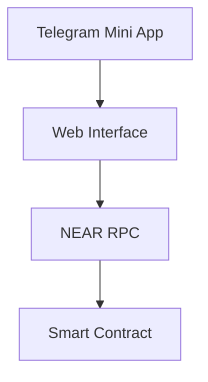

# Экспресс-курс: Веб-приложение + Telegram Mini App + NEAR Blockchain

```dataview
TABLE status, priority
FROM "Courses/NEAR-Telegram"
SORT created DESC
```

---

## 1. Архитектура проекта
**Цель**: Создать систему, где:
1. Пользователь открывает приложение в Telegram
2. Кошелек NEAR подключается через веб-интерфейс
3. Кнопки вызывают методы смарт-контракта



---

## 2. Настройка проекта
### Зависимости
```bash
npm install near-api-js @telegram-web-app/core react react-dom
```

### Структура файлов
```
/src
|-- components/      # Кнопки, формы
|-- contracts/       # Смарт-контракты
|-- services/        # NEAR API, Telegram API
|-- App.jsx          # Основной компонент
```

---

## 3. Смарт-контракт (Rust)
`contracts/src/lib.rs`:
```rust
use near_sdk::borsh::{self, BorshDeserialize, BorshSerialize};
use near_sdk::{env, near_bindgen, AccountId};

#[near_bindgen]
#[derive(BorshDeserialize, BorshSerialize)]
pub struct Counter {
    value: u64,
}

impl Default for Counter {
    fn default() -> Self {
        Self { value: 0 }
    }
}

#[near_bindgen]
impl Counter {
    pub fn increment(&mut self) {
        self.value += 1;
        env::log_str(&format!("New value: {}", self.value));
    }

    pub fn get_value(&self) -> u64 {
        self.value
    }
}
```

---

## 4. Frontend (React + Telegram WebApp)
`components/NearButton.jsx`:
```jsx
import { connect, keyStores } from 'near-api-js';

export default function NearButton() {
  const handleTransaction = async () => {
    // Инициализация NEAR
    const near = await connect({
      networkId: 'testnet',
      keyStore: new keyStores.BrowserLocalStorageKeyStore(),
      nodeUrl: 'https://rpc.testnet.near.org',
      walletUrl: 'https://wallet.testnet.near.org'
    });

    // Вызов метода контракта
    const account = await near.account('you.testnet');
    await account.functionCall({
      contractId: 'counter-contract.testnet',
      methodName: 'increment',
      args: {}
    });
  };

  return (
    <button onClick={handleTransaction}>
      Increment Counter
    </button>
  );
}
```

---

## 5. Интеграция с Telegram
`services/telegram.js`:
```javascript
import { WebApp } from '@telegram-web-app/core';

export const initTelegram = () => {
  WebApp.ready();
  WebApp.MainButton.setText('Connect NEAR').show();
  
  WebApp.MainButton.onClick(() => {
    window.nearWalletConnection.requestSignIn();
  });
};
```

---

## 6. Безопасность
- Всегда проверяйте origin транзакций:
```javascript
if (window.Telegram.WebApp.initDataUnsafe.user?.id !== expectedUserId) {
  throw new Error("Unauthorized!");
}
```

---

## 7. Развертывание
1. Контракт:
```bash
near deploy counter-contract.testnet ./contracts/target/wasm32-unknown-unknown/release/contract.wasm
```

2. Frontend:
```bash
vercel deploy --prod
```

3. Telegram Bot:
```bash
curl -X POST "https://api.telegram.org/bot<TOKEN>/setCustomMenu" -d '{
  "menu_button": {
    "type": "web_app",
    "text": "Open App",
    "web_app": { "url": "https://your-vercel-app.vercel.app" }
  }
}'
```

---

## 8. Тестирование
1. Локально:
```bash
near sandbox
npm run dev
```

2. В Telegram:
```javascript
// Добавьте в index.html
window.Telegram = { 
  WebApp: { 
    initDataUnsafe: { user: { id: 12345 } },
    ready: () => {},
    MainButton: { show: () => {}, onClick: () => {} }
  } 
};
```

---

## 9. Дополнительные ресурсы
- [NEAR Documentation](https://docs.near.org)
- [Telegram Web Apps](https://core.telegram.org/bots/webapps)
- Примеры контрактов: `/contracts/examples`

---

## 10. Чеклист перед запуском
- [ ] Контракт задеплоен в testnet
- [ ] Кошелек подключен через near-api-js
- [ ] Telegram WebApp инициализирован
- [ ] Обработка ошибок транзакций
